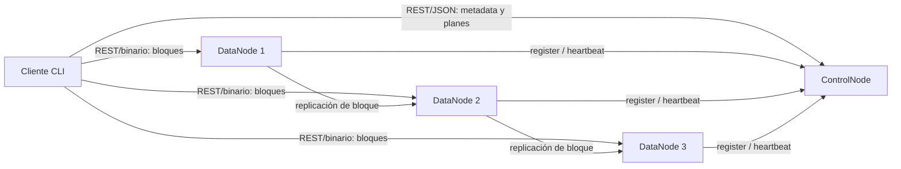
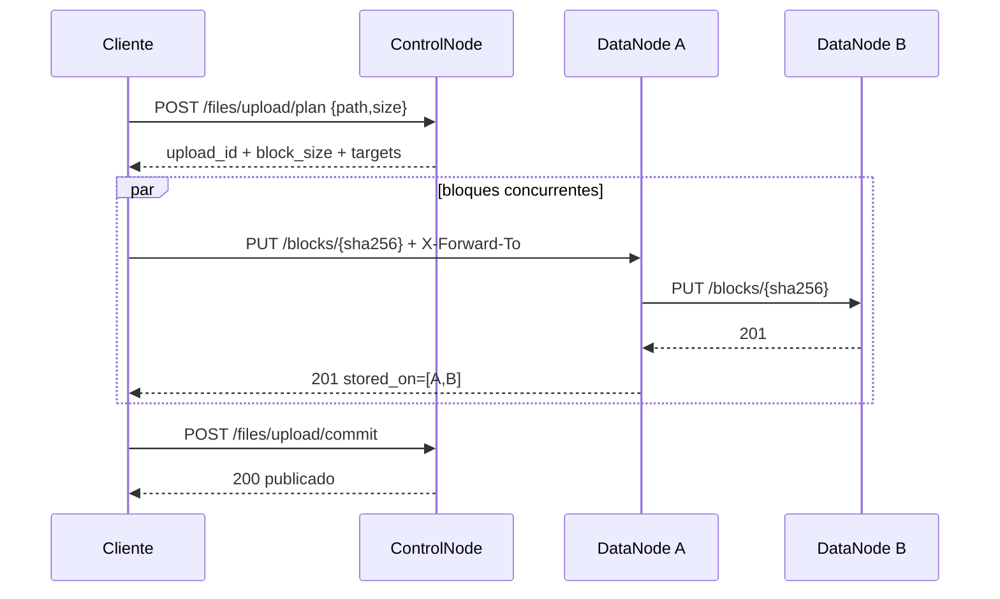
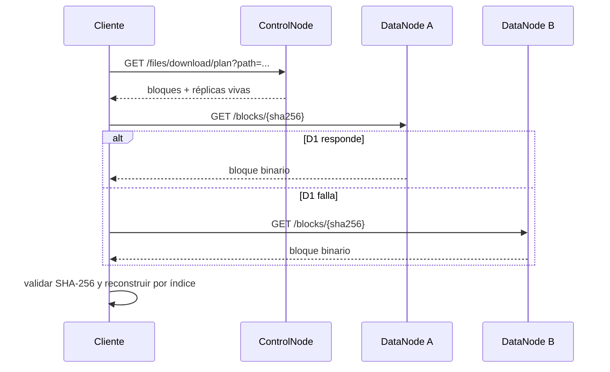

# Hito 2 — Diseño e implementación de arquitectura distribuida y comunicaciones

## 1. Alcance del hito

El objetivo de este hito es convertir la especificación del Hito 1 en una arquitectura distribuida ejecutable para la **Opción 1: Cliente/Servidor con el servicio distribuido entre varios nodos**, y dejar completamente definidos los contratos de comunicación entre componentes.

El prototipo implementa el plano de datos distribuido con tres DataNodes y un ControlNode activo. La arquitectura final definida en Hito 1 conserva tres ControlNodes, pero su replicación, elección de líder y persistencia tolerante a fallos se implementarán en Hito 3, junto con seguridad completa.

## 2. Arquitectura

### 2.1 Patrón

Se utiliza **Maestro–Trabajador (Master–Workers)**:

- **Cliente DFSha:** interfaz CLI. Parte/reconstruye archivos y ejecuta operaciones del namespace.
- **ControlNode:** plano de control; mantiene metadatos, conoce DataNodes vivos y calcula planes de lectura/escritura.
- **DataNode:** plano de datos; almacena bloques y atiende transferencias binarias.

### 2.2 Separación de planos

El cliente consulta al ControlNode únicamente para decisiones y metadatos. Los bytes del archivo no pasan por el ControlNode: viajan directamente entre cliente y DataNodes. Con esto el ControlNode no se convierte en cuello de botella para archivos grandes.

## 3. Decisiones de implementación

### 3.1 Particionamiento

El ControlNode calcula un tamaño de bloque dentro de 8–64 MiB. Para archivos grandes usa como referencia:

`B = clamp(block_size_min, S / (k·N), block_size_max)`

con `k=4`, y redondea a la potencia de dos inferior. El cliente ejecuta físicamente el corte para evitar que el ControlNode reciba el archivo completo.

### 3.2 Distribución

Para cada bloque se seleccionan DataNodes por menor porcentaje de ocupación. Durante la creación del plan se mantiene una carga virtual para que varios bloques de una misma subida no sean asignados todos al mismo nodo por haber consultado la misma ocupación inicial.

### 3.3 Replicación en el plano de datos

Con al menos dos DataNodes, cada bloque tiene dos destinos. El cliente envía el bloque una sola vez al primer destino y comunica el resto mediante `X-Forward-To`. El primer DataNode lo propaga internamente. Esto implementa desde Hito 2 la comunicación **DataNode ↔ DataNode** y evita duplicar el tráfico de subida del cliente.

### 3.4 Integridad

Cada bloque se identifica por `SHA-256(contenido)`. El DataNode vuelve a calcular la firma antes de publicar el archivo de bloque en disco. Durante descarga, el cliente vuelve a validar la firma antes de reconstruir.

### 3.5 Concurrencia

El cliente usa cuatro workers por defecto para subir/descargar bloques en paralelo. Cada DataNode usa el servidor HTTP concurrente de Go, que atiende cada conexión en una goroutine.

## 4. Especificación de comunicaciones

### 4.1 Formato

- Control: REST + JSON.
- Datos: REST + cuerpo binario `application/octet-stream`.
- `Authorization: Bearer <token>` para operaciones de cliente.
- `X-Cluster-Key` para tráfico interno entre nodos.
- En el prototipo local se usa HTTP. El contrato no cambia al activar HTTPS en Hito 3.

### 4.2 Cliente ↔ ControlNode

| Método | Endpoint | Entrada principal | Salida principal |
|---|---|---|---|
| POST | `/auth/login` | `username`, `password` | `token`, `expires_in` |
| GET | `/fs/ls?path=` | ruta | `entries[]` |
| POST | `/fs/mkdir` | `path` | ruta creada |
| DELETE | `/fs/rmdir?path=` | ruta | 204 |
| DELETE | `/fs/rm?path=` | ruta | 204 |
| POST | `/fs/mv` | `src`, `dst` | rutas |
| GET | `/fs/stat?path=` | ruta | tamaño, bloques, réplicas |
| POST | `/files/upload/plan` | `path`, `size` | `upload_id`, `block_size`, `blocks[].targets[]` |
| POST | `/files/upload/commit` | `upload_id`, bloques almacenados | `status=publicado` |
| POST | `/files/upload/abort` | `upload_id` | 204 |
| GET | `/files/download/plan?path=` | ruta | bloques y réplicas vivas |

### 4.3 Cliente ↔ DataNode

| Método | Endpoint | Entrada | Salida |
|---|---|---|---|
| PUT | `/blocks/{id}` | binario; opcional `X-Forward-To` | `block_id`, `size`, `stored_on` |
| GET | `/blocks/{id}` | opcional `Range` | binario / 206 parcial |

### 4.4 ControlNode ↔ DataNode

| Método | Endpoint | Entrada | Propósito |
|---|---|---|---|
| POST | `/cluster/register` | id, host, puerto, capacidad | alta del DataNode |
| POST | `/cluster/heartbeat` | id, capacidad, uso | señal de vida cada 3 s |
| POST | `/cluster/blockreport` | id, lista de block IDs | contrato de inventario |
| DELETE | `/blocks/{id}` | `X-Cluster-Key` | eliminación interna |
| POST | `/blocks/{id}/replicate` | destino | copia/reparación manual |

### 4.5 ControlNode ↔ ControlNode

Se mantienen los contratos definidos en Hito 1:

- `POST /cluster/replicate`
- `POST /cluster/election`

En Hito 2 devuelven `501`, porque la lógica de alta disponibilidad y consistencia del plano de control se implementa en Hito 3.

## 5. Secuencia de subida

## 6. Secuencia de descarga

## 7. Despliegue

El entorno de Hito 2 usa Docker Compose con:

- `controlnode` → puerto 8000.
- `dn1`, `dn2`, `dn3` → puerto interno 8001.
- `client` como contenedor de herramientas bajo el perfil `tools`.
- Un volumen persistente por DataNode.

Para AWS Academy, el mismo binario/contenedor puede ubicarse en las EC2 previstas por Hito 1. En esa fase se cambia únicamente el direccionamiento y las reglas de red; los contratos HTTP permanecen iguales.

## 8. Pruebas propuestas para la sustentación

1. Levantar el clúster y comprobar que el ControlNode ve tres DataNodes vivos.
2. Crear `/demo`.
3. Subir un archivo mayor que un bloque y mostrar en logs que distintos bloques son asignados a nodos diferentes.
4. Verificar que cada bloque termina en dos DataNodes.
5. Descargar el archivo y comparar SHA-256 del original y el reconstruido.
6. Detener un DataNode después de haber subido el archivo y demostrar que una descarga puede usar otra réplica si el plan contiene una copia viva.
7. Consultar `stat` y `ls` para demostrar separación entre namespace/metadatos y plano de datos.

## 9. Criterio de completitud de Hito 2

Se considera cumplido porque existe una arquitectura distribuida ejecutable donde cliente, plano de control y varios nodos de datos se comunican por red; el archivo se parte en bloques y los datos no atraviesan el ControlNode; los bloques se distribuyen y replican entre DataNodes; y los contratos de comunicación de todas las relaciones previstas quedan definidos. Las garantías de alta disponibilidad del ControlNode, consistencia replicada y seguridad definitiva quedan explícitamente trazadas al Hito 3.
