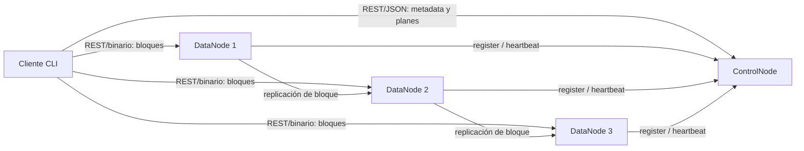
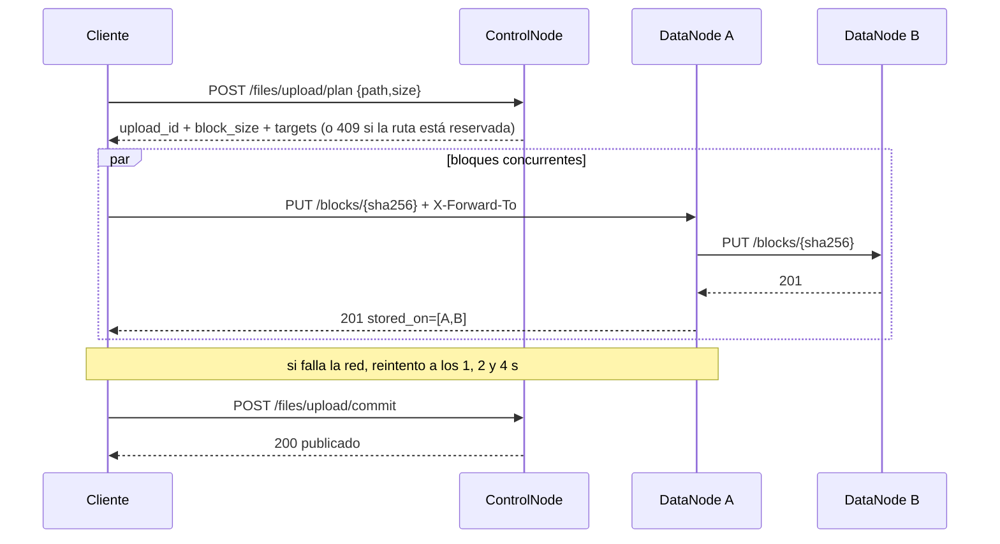
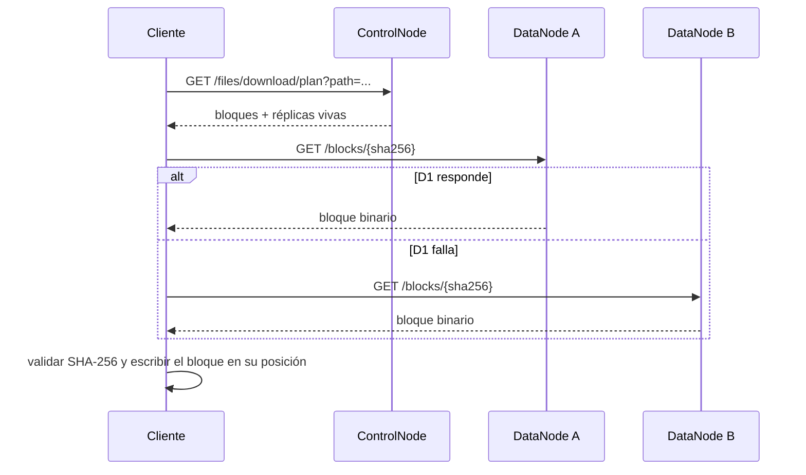

# Hito 2 — Diseño e implementación de arquitectura distribuida y comunicaciones

## 1. Alcance del hito

El objetivo de este hito es convertir la especificación del Hito 1 ([`hito-1-especificacion.pdf`](hito-1-especificacion.pdf)) en una arquitectura distribuida ejecutable para la **Opción 1: Cliente/Servidor con el servicio distribuido entre varios nodos**, y dejar completamente definidos los contratos de comunicación entre componentes.

El prototipo implementa el plano de datos distribuido con tres DataNodes y un ControlNode activo. La arquitectura final definida en el Hito 1 conserva tres ControlNodes, pero su replicación, elección de líder y persistencia tolerante a fallos se implementan en el Hito 3, junto con la seguridad completa. Así lo fija el cronograma del curso: el Hito 3 es *Alta Disponibilidad, Replicación, Consistencia y Seguridad*.

## 2. Arquitectura

### 2.1 Patrón

Se utiliza **Maestro–Trabajador (Master–Workers)**:

- **Cliente DFSha:** interfaz CLI. Parte y reconstruye archivos y ejecuta operaciones del espacio de nombres.
- **ControlNode:** plano de control; mantiene metadatos, conoce los DataNodes vivos y calcula planes de lectura y escritura.
- **DataNode:** plano de datos; almacena bloques y atiende transferencias binarias.

### 2.2 Separación de planos

El cliente consulta al ControlNode únicamente para decisiones y metadatos. Los bytes del archivo no pasan por el ControlNode: viajan directamente entre cliente y DataNodes. Con esto el ControlNode no se convierte en cuello de botella para archivos grandes.



### 2.3 Organización del código

Cada nodo es un binario de Go independiente. Dentro de cada uno, el código se separa por responsabilidad en archivos del mismo paquete; no se introducen capas adicionales porque cada servicio tiene pocos cientos de líneas.

| Archivo | Responsabilidad |
|---|---|
| `cmd/controlnode/config.go` | Parámetros operativos leídos de variables de entorno y su validación |
| `cmd/controlnode/planner.go` | Decisiones puras de particionamiento y ubicación: tamaño de bloque, número de copias, destinos |
| `cmd/controlnode/handlers_*.go` | Endpoints HTTP agrupados por tema: autenticación, sistema de archivos, subida, descarga, clúster |
| `cmd/controlnode/server.go` | Estado en memoria y tabla de rutas |
| `cmd/datanode/handlers.go` | Endpoints de bloques |
| `cmd/datanode/control_client.go` | Comunicación DataNode → ControlNode (registro y heartbeat) |
| `cmd/datanode/peer_client.go` | Comunicación DataNode → DataNode (propagación de copias) |
| `cmd/datanode/storage.go` | Disco local |
| `client/dfsha.py` | Cliente CLI |

`planner.go` no depende de HTTP ni del estado del servidor, así que la lógica que decide dónde va cada bloque se prueba de forma aislada.

## 3. Decisiones de implementación

### 3.1 Particionamiento

El ControlNode calcula el tamaño de bloque con la fórmula del Hito 1 [N3]:

`B = clamp(block_size_min, S / (k·N), block_size_max)`

con `k = 4`, 8 MB y 64 MB por defecto, redondeando a la potencia de dos inferior. El cliente ejecuta físicamente el corte para evitar que el ControlNode reciba el archivo completo. Cada worker del cliente lee solo su bloque del disco, de modo que en memoria nunca hay más de `workers × block_size` bytes, sin importar el tamaño del archivo.

### 3.2 Distribución

Para cada bloque se seleccionan DataNodes por menor porcentaje de ocupación (asignación voraz de Graham, [N5]). Durante la creación del plan se mantiene una carga virtual para que los bloques de una misma subida no se asignen todos al mismo nodo por haber consultado la misma ocupación inicial. Los empates se resuelven por identificador de nodo, para que el plan sea reproducible.

### 3.3 Número de copias

Se aplican las dos reglas del Hito 1 [N4]:

- El factor configurado nunca supera `N − 1`, donde `N` es el número de DataNodes registrados en el clúster, para que siempre exista un nodo donde rehacer una copia perdida. Con 3 DataNodes y factor 2, se guardan 2 copias; con 2 DataNodes, 1.
- Si hay menos DataNodes vivos que ese factor, se guardan las copias posibles en vez de rechazar la escritura, y el ControlNode deja un aviso en su registro.

Las copias de un mismo bloque siempre quedan en DataNodes distintos.

### 3.4 Replicación en el plano de datos

El cliente envía cada bloque una sola vez al primer destino y comunica el resto mediante `X-Forward-To`. El primer DataNode lo propaga internamente [N12]. Esto implementa desde el Hito 2 la comunicación **DataNode ↔ DataNode** y evita duplicar el tráfico de subida del cliente.

### 3.5 Integridad e idempotencia

Cada bloque se identifica por `SHA-256(contenido)`. El DataNode vuelve a calcular la firma antes de publicar el bloque en disco, y escribe primero a un archivo temporal que renombra al final, para que nunca quede visible un bloque a medias. Durante la descarga, el cliente valida la firma antes de escribir cada bloque.

Subir un bloque es idempotente: si el DataNode ya lo tiene, no lo reescribe pero sí lo propaga a los destinos de `X-Forward-To`, de modo que un reintento o un contenido repetido en otro archivo no dejan el bloque con menos copias.

### 3.6 Un solo escritor por archivo

Pedir un plan de subida reserva la ruta durante `write_lease_ttl` (60 s). Mientras la reserva esté vigente, otro plan sobre la misma ruta recibe `409`. Si el cliente muere, la reserva vence sola y la ruta queda libre. El archivo solo se publica en el commit, así que un archivo a medio subir nunca es visible.

### 3.7 Concurrencia

El cliente usa cuatro workers por defecto (`--workers`) para subir y descargar bloques en paralelo [N10]. Cada DataNode usa el servidor HTTP concurrente de Go, que atiende cada conexión en una goroutine.

## 4. Especificación de comunicaciones

### 4.1 Formato

- Control: REST + JSON.
- Datos: REST + cuerpo binario `application/octet-stream`, sin codificar [N11].
- `Authorization: Bearer <token>` para operaciones de cliente.
- `X-Cluster-Key` para tráfico interno entre nodos.
- En el prototipo local se usa HTTP. El contrato no cambia al activar HTTPS en el Hito 3.

### 4.2 Errores y reintentos

- **Escritura de bloque:** ante un fallo de red (sin respuesta del servidor), el cliente reintenta contra el mismo DataNode hasta 3 veces, esperando 1, 2 y 4 segundos. Es seguro porque la operación es idempotente. Una respuesta de error del servidor (por ejemplo `409` por firma incorrecta) no se reintenta.
- **Lectura de bloque:** si una réplica no responde o entrega una firma incorrecta, el cliente pasa de inmediato a la siguiente réplica, sin reintentar la misma, tal como define el Hito 1.
- **Plan vencido:** si el commit llega después de vencida la reserva, el ControlNode responde `410`.

### 4.3 Cliente ↔ ControlNode

| Método | Endpoint | Entrada principal | Salida principal | Errores |
|---|---|---|---|---|
| POST | `/auth/login` | `username`, `password` | `token`, `expires_in` | 401 |
| GET | `/fs/ls?path=` | ruta | `entries[]` | 404 |
| POST | `/fs/mkdir` | `path` | ruta creada (201) | 409 ya existe, 404 sin padre |
| DELETE | `/fs/rmdir?path=` | ruta | 204 | 409 no vacío, 404 |
| DELETE | `/fs/rm?path=` | ruta | 204 | 404 |
| POST | `/fs/mv` | `src`, `dst` | rutas | 404, 409 destino existe |
| GET | `/fs/stat?path=` | ruta | tamaño, bloques, réplicas, dueño | 404 |
| POST | `/files/upload/plan` | `path`, `size` | `upload_id`, `block_size`, `blocks[].targets[]` | **409 reserva activa**, 404, 503 sin DataNodes |
| POST | `/files/upload/commit` | `upload_id`, bloques almacenados | `status=publicado` | 409 faltan bloques, 410 reserva vencida |
| POST | `/files/upload/abort` | `upload_id` | 204 | ninguno |
| GET | `/files/download/plan?path=` | ruta | bloques y réplicas vivas | 404, 503 bloque sin copias |

### 4.4 Cliente ↔ DataNode

| Método | Endpoint | Entrada | Salida |
|---|---|---|---|
| PUT | `/blocks/{id}` | binario; opcional `X-Forward-To` | 201 si lo creó, 200 si ya existía; `block_id`, `size`, `stored_on` |
| GET | `/blocks/{id}` | opcional `Range` | binario / 206 parcial |

### 4.5 ControlNode ↔ DataNode

| Método | Endpoint | Entrada | Propósito |
|---|---|---|---|
| POST | `/cluster/register` | id, host, puerto, capacidad | alta del DataNode |
| POST | `/cluster/heartbeat` | id, capacidad, uso | señal de vida cada `heartbeat_interval` |
| POST | `/cluster/blockreport` | id, lista de block IDs | contrato de inventario |
| DELETE | `/blocks/{id}` | `X-Cluster-Key` | eliminación interna |
| POST | `/blocks/{id}/replicate` | destino | copia de un bloque a otro nodo |

### 4.6 ControlNode ↔ ControlNode

Se mantienen los contratos definidos en el Hito 1:

- `POST /cluster/replicate`
- `POST /cluster/election`

En el Hito 2 devuelven `501`, porque la lógica de alta disponibilidad y consistencia del plano de control se implementa en el Hito 3.

## 5. Secuencia de subida



## 6. Secuencia de descarga



## 7. Parámetros

Todos los parámetros que usa la lógica implementada se leen de variables de entorno al arrancar. En Docker Compose se cambian sin editar ni recompilar nada, por ejemplo `REPLICATION_FACTOR=1 docker compose up -d`, o en un archivo `.env`. Un valor inválido detiene el arranque con un mensaje que dice cuál variable está mal.

| Parámetro del Hito 1 | Variable de entorno | Por defecto | Estado |
|---|---|---|---|
| `replication_factor` | `REPLICATION_FACTOR` | 2 | Implementado |
| `block_size_min` | `BLOCK_SIZE_MIN_MB` | 8 | Implementado |
| `block_size_max` | `BLOCK_SIZE_MAX_MB` | 64 | Implementado |
| `blocks_per_node` (k) | `BLOCKS_PER_NODE` | 4 | Implementado |
| `heartbeat_interval` | `HEARTBEAT_INTERVAL_SECONDS` | 3 | Implementado (ControlNode y DataNode) |
| `heartbeat_misses` | `HEARTBEAT_MISSES` | 3 | Implementado: un nodo se da por muerto a los 3 × 3 = 9 s |
| `write_lease_ttl` | `WRITE_LEASE_TTL_SECONDS` | 60 | Implementado |
| `client_parallel_blocks` | opción `--workers` del cliente | 4 | Implementado |
| `availability_target` | — | — | Ver cambio 3 en la sección 9 |
| `node_full_threshold` | — | — | Hito 3, junto con el rebalanceo |
| `rebalance_threshold` | — | — | Hito 3, junto con el rebalanceo |
| `blockreport_interval` | — | — | Hito 3, junto con la auto-reparación |
| `cn_heartbeat_interval` | — | — | Hito 3, junto con los tres ControlNodes |

No se exponen variables para los parámetros de funciones que todavía no existen, porque serían configuraciones sin efecto.

## 8. Despliegue

El entorno de este hito usa Docker Compose con:

- `controlnode` → puerto 8000.
- `dn1`, `dn2`, `dn3` → puerto interno 8001.
- `client` como herramienta bajo el perfil `tools`. No declara dependencias para no volver a encender un DataNode detenido a propósito durante una prueba de fallos.
- Un volumen persistente por DataNode.

Para AWS Academy, los mismos contenedores se ubican en las EC2 previstas por el Hito 1. Solo cambian el direccionamiento (`ADVERTISE_HOST`, `CONTROL_URL`) y las reglas de red; los contratos HTTP permanecen iguales.

## 9. Cambios respecto al Hito 1

El Hito 1 previó que cualquier ajuste se documentaría en los hitos siguientes (RNF8). Estos son los cambios de decisión frente a lo planteado; lo que simplemente se implementa en un hito posterior está en la sección 10.

**1. `cd` no se implementa como comando con estado de sesión.** El Hito 1 lo definió como un comando que maneja el cliente. El CLI construido es *stateless*: cada comando es un proceso nuevo y no hay una sesión que recuerde un directorio actual. La navegación se resuelve pasando la ruta completa a cada comando (`ls`, `stat`, `put`, `get`, `mv`), que cumple el mismo propósito sin agregar estado local que pueda quedar desincronizado con el servicio.

**2. Las primitivas de RF3 (`open`, `read` por rango, `write`, `lock`, `close`) no se exponen como comandos ni endpoints separados.** Siguen siendo el modelo que fundamenta `put` y `get`: el plan de subida es el `open` con `lock` (reserva de la ruta), cada `PUT` de bloque es un `write`, el commit es el `close`, y el DataNode ya soporta lectura parcial con la cabecera `Range`. Exponerlas como superficie aparte no lo exige ningún criterio de este hito y agregaría una API que habría que mantener y asegurar en el Hito 3. Se reconsiderará solo si un hito posterior exige acceso aleatorio explícito a archivos.

**3. Los parámetros se leen de variables de entorno, no de un archivo de configuración propio, y `availability_target` no se expone.** El Hito 1 pedía que ningún valor estuviera en el código y que se cambiaran sin recompilar; eso se cumple. Las variables de entorno son el mecanismo nativo de Docker Compose, y un archivo `.env` junto al `docker-compose.yml` cumple el papel del archivo de configuración sin un formato adicional que leer y validar. El factor de replicación se configura directamente: el valor sale de aplicar la fórmula de disponibilidad de [N4] al objetivo deseado, y recalcularlo en cada arranque no aporta nada porque el resultado solo cambia cuando cambia el objetivo, que es justo cuando se ajusta la variable.

**4. Subir un bloque que ya existe responde `200`, no `409`.** El Hito 1 especificaba `409 ya existe y se trata como éxito`. En HTTP, un `PUT` es idempotente y repetirlo con el mismo contenido es una operación exitosa, así que `200` describe mejor lo que pasa y evita que el cliente tenga que interpretar un código de error como éxito. Un bloque nuevo sigue respondiendo `201`.

## 10. Pendiente para el Hito 3

Se deja explícitamente para el hito de Alta Disponibilidad, Replicación, Consistencia y Seguridad:

- **Tres ControlNodes** con replicación de metadatos y elección de líder (`/cluster/replicate` y `/cluster/election` responden `501`).
- **Persistencia de metadatos** en disco: hoy viven en memoria y se pierden si el ControlNode se reinicia.
- **Auto-reparación de copias:** el campo `orders` de la respuesta del heartbeat existe pero siempre va vacío, y el reporte de bloques se recibe pero no se compara con los metadatos. Por eso, si un DataNode muere, o si falla la propagación de un bloque durante una subida, ese bloque se queda con menos copias hasta que exista la reparación. `ls` y `stat` lo muestran en `replicas_ok`.
- **Rebalanceo** al agregar un nodo y `node_full_threshold`.
- **Recolección de bloques huérfanos** tras `rm` o una subida abortada.
- **Re-planificación automática** en el cliente cuando el commit responde `410`.
- **Seguridad:** HTTPS, cifrado de bloques en disco y control de acceso real por usuario. Hoy hay un único usuario de demostración.
- **Despliegue en AWS Academy** según la sección 5 del Hito 1.

## 11. Pruebas y resultados

### 11.1 Pruebas automáticas

```bash
go test ./...                          # planificador y reserva activa
python3 -m unittest discover client    # reintentos y reconstrucción por posición
```

| Prueba | Qué verifica |
|---|---|
| `TestChooseBlockSize` | Fórmula de tamaño de bloque: mínimo, máximo y redondeo a potencia de dos |
| `TestCopiesPerBlock` | Tope `N − 1` sobre nodos registrados y "guarda las copias que puede" con nodos caídos |
| `TestPlaceBlocksUsesDistinctNodesAndBalances` | Copias en nodos distintos y reparto parejo (6 bloques × 2 copias = 4 por nodo) |
| `TestPlaceBlocksPrefersEmptierNode` | La heurística elige el nodo menos ocupado |
| `TestSecondUploadPlanOnSamePathIsRejected` | Segunda reserva sobre la misma ruta → `409` |
| `TestExpiredReservationIsReleased` | Una reserva vencida libera la ruta |
| `TestUploadPlanCopiesPerBlock` | 3 DataNodes → 2 copias; 2 DataNodes → 1 copia |
| `test_retries_network_failures_with_growing_waits` | Reintentos con esperas de 1 y 2 s hasta tener éxito |
| `test_gives_up_after_three_retries` | 4 intentos en total (1, 2 y 4 s) y luego falla |
| `test_does_not_retry_server_errors` | Un error HTTP del servidor no se reintenta |
| `test_blocks_written_out_of_order_rebuild_the_file` | Bloques escritos en desorden reconstruyen el archivo exacto |

### 11.2 Prueba de punta a punta

`scripts/demo.sh` levanta el clúster y ejecuta la secuencia completa. Resultado obtenido:

| Paso | Resultado |
|---|---|
| Clúster levantado | El ControlNode reporta 3 DataNodes vivos |
| Subida de 40 MB | 5 bloques de 8 MB, cada uno con 2 copias en DataNodes distintos; `ls` y `stat` muestran `replicas_ok: 2` |
| Descarga | Archivo reconstruido; SHA-256 idéntico al original |
| Dos planes seguidos sobre la misma ruta | `200` y luego `409` |
| Descarga con `dn1` apagado | El ControlNode reporta 2 DataNodes vivos; los bloques que estaban en `dn-01` se leen de su otra réplica y el SHA-256 sigue idéntico |

### 11.3 Pruebas manuales adicionales

| Escenario | Resultado |
|---|---|
| Subida con un DataNode destino caído que vuelve a los 3 s | El cliente registra "reintento 1/3 en 1s" y "reintento 2/3 en 2s" y el bloque se sube en el tercer intento |
| 3 DataNodes registrados, 1 caído | El plan asigna 2 copias por bloque entre los 2 vivos |
| Clúster de solo 2 DataNodes | El plan asigna 1 copia por bloque (`N − 1`) |
| `BLOCK_SIZE_MIN_MB=4` al levantar | El bloque pasa a 4 MB sin recompilar |
| `REPLICATION_FACTOR=dos` | El ControlNode no arranca y reporta `REPLICATION_FACTOR="dos" no es un entero` |
